# 5004Project
5004_drawboard_final_project

## What is this project and how it works

This project displays animation following users' valid instructions by producing and showing the text description of the animation. In this application, in order to display an animation, an animation interface allows a user to add shapes and to define moves on the existing shapes.

In this application, there are 3 interfaces in total, they are: IAnimation, IShape and IMovement. An animation can have zero to many shapes, and a shape can have zero to many movements. We will discuss the purpose of each interface and each class in the following section.

## Purpose behind each interface and each class (including updates)

### Project Structure updates
To achieve MVC design, we have organized our classes into the following packages:
-	Model: This package includes the model and its related classes. IAnimation serves as our model here.
-	View: This package includes the IView interface and its implemented classes. Thereare three IView implementations in this package: TextView, SVGView and Visual View. 
-	(Controller: This package potential would include our controller class in the future)
-	Util: This packge includes all the helper and adapter classes. 
Besides the src and test folder, we also included a resource folder where reference docs, JAR file, input files and output files will be stored. 

### IAnimation and AnimationImpl 
Please see updates at the end of this section.

#### IAnimation 
IAnimation interface contains all the operations that apply to all animations. This interface allows an user:
-	to add a shape to the animation by passing in a shape; 
-	to define a movement on a shape (possible movements includes to change color of a shape, to move its position or to scale its dimensions); 
-	to show (initial status) of all shapes that are existing in this animation;
-	to get all movements or to display the animation;
-	to collect and show the status of all appearing shapes at certain point of time

#### AnimationImpl
This IAnimation interface is implemented in AnimationImpl class, where it has list of all shapes that ever existed in the animation to keep and track data to achieve all the above operations in an animation. 

#### IAnimation and AnimationImp updates:
we have refactored the model (IAnimation interface) in order to be able to read input files in certain specific format. The changes we made can be summarized here:
-	Previously to create a shape in an animation, the shape has to be created in advance separately, where all the initials including it appear time and disappear time has to be provided. However, now our animation only takes in two parameters – name and a shape type – to declare a shape in the animation. All attributes of the shape stays unknown until a motion has been passed in to this animation, and the attributes would be assigned to the shape based on the motions attached to this shape subsequentially.  
-	Previously to add a motion into the animation for some shape, a user would have to define specifically what type of motion (scale/color-change/move) would it be and provides the corresponding attributes change. Now we have updated our model so that when a user would like to pass in a motion, the user does not need to specify the motion type – all the animation needs is the shape’s initial attributes at the beginning of this motion and its target attributes at the end of the motion. In this way, the user would be able to set motion changes for multiple attributes with calling addMotion method once.
-	As we still use fields to store shape’s attribute status timeline, we kept the methods of getting the shape’s status at certain passed in moment. However we have set those methods as protected or private as needed because those methods will only be called internally. 
-	We have removed all display-related (toString, showAll, showMotions, showShapes, etc) methods from the Model because those functionalities belong to the View. 
-   We have two getter method in the AnimationImpl class - getBounds and getListOfShapes. Previously these two methods return the field objects directly. Now we have updated these getter methods so that the getter methods return a new object that copies from the field. In this way the getter method would not be able to mutate the fields in any way. 

### IView
A general interface for view.
Subclasses: VisualView, TextView, SVGView, PlayBack

#### VisualView
- extends JFrame
- This class represents the visual view that display an animation using swing. The field of this class includes a speed.
- Contains a Scrollbar; Vertical always on; Horizontal as needed.

#### ViewPanel
- A panel that contains the shapes to be printed.
- FPS 60

#### ViewOption
- An enum class: restrict user input for view.
- [Visual, SVG, Text, PlayBack]

#### InputMessage
- Created a JFrame based window to give a hint of input errors user has made.
  
#### TextView
- Provides a text view according to user input.

#### SVGView
- Provides a SVG view according to user input. Default to System.out if out path not specified.

  
#### PlayBackView
- A Swing based panel that draws a view. Allow user to play, pause, resume, loop, change speed and save file.
 
  
  
  Start, Pause and Resume are on one button.
  
      // Start & Pause & Resume button
      JToggleButton pause = new JToggleButton("Start");
  
      pause.addChangeListener(new ChangeListener() {
        @Override
        public void stateChanged(ChangeEvent e) {
          if(pause.isSelected()){
            viewPanel.playAnime();
            pause.setText("Pause");
          } else {
            viewPanel.pauseAnime();
            pause.setText("Play");
          }
        }
      });

- Save would pop up a new window for user to choose the proper format to save the file.

  
  
 Used ToggleButton, JButton and Radio button in the file.
 
### IShape, AbstractShape and concrete shape classes
Please see updates at the end of this section.

#### IShape
IShape interface contains operations that applies to all shapes. As mentioned above, a shape can have zero to many movements as long as 1, the shape is appearing during the desired movement time, and 2, the shape is available for certain move during the desired movement time, which means the shape is not occupied with the same type of movement during the desired movement time. Therefore, a shape should be able to operate the following on itself:
-	to make a movement on itself. Possible change includes to change its color, to change its dimension, to move its position;
-	to get a copy of itself;
-	to generate a list of all movements that apply to itself.

#### Rectangle, Circle and Oval
This IShape interface is implemented in many specific concrete shape classes, such as Oval class, Circle class, Rectangle class, etc., and each of the concrete class has the following fields to help track data and achieve all the operations mentioned in the IShape interface:
-	basic data (name, type, color, appear time, disappear time) that used to initialize itself;
-	list of 1’s and 0’s that indicates a status that whether if itself is available for certain movement at a specific time point;
-	lists of Color, Point2D and its dimension to track the data of itself at any point of time.

#### AbstractShape
As there are many common operations and fields that all the these concrete shapes share, we created an abstract class called AbstractedShape that implements IShape interface to represent all the common fields and common methods, and all concrete shape classes extend the AbstractShape.

#### IShape, AbstractShape and concrete shape classes updates:
- we have renamed our Oval class to Ellipse class so that it would be consistent with rest part of the project. 
-	we have deleted our Circle class because circle, in a sense, is just a kind of Ellipse that has the same xRadius and yRadius. To keep it simple, we have deleted Circle class.
-	Attributes reference in our Abstract class has been changed. Previously the magnitude attributes for an ellipse is xRadius and yRadius, which is inconsistent or inconvenient when the passed in width and height are for xDiameter and yDiameter. Therefore to keep the consistency, we refereed the passed in dimension data for an ellipse to its both diameters, instead of radius. 

### Movement and concrete movement classes
Please see updates at the end of this section.

#### Movement
Movement interface includes operations that applies to all movement classes. The only operations included in a Movement interface is to display itself and get the start time of when the movement starts. As for now we are using a text description to display animations, so the display operation in Movement also returns a text description in String. 

#### Move, ColorChange, Scale
Concrete movement classes includes Move, ColorChange and Scale. Each of them performs a specific type of movement to a shape. All of them implements the display methods in String format. 
-	Move: it moves a shape to a target position by the end of the movement;
-	ColorChange: it changes the color of a shape to a target color by the end of the movement;
-	Scale: it scales the dimensions of a shape by multiplying its current dimension to a scaling factor by the end of the movement.

#### Movement and concrete movement classes updates:
-	Previously there are 3 classes implemented under Movement interface, however now we have 4 – Move and ColorChange stay the same, and we have separated the Scale motion into two: WidthScale and HeightScale. This change allows users to scale a shape’s width (or xDiameter) and height (or yDiameter) separately, and in this way the width-height ratio does not always have to stay the same anymore.  
-	After addMotion method is called, some inner helper function would check the status changes among all the attributes, if there is change in any attributes, the corresponding motion(s) would be added/attached to the shape in the animation, if the attributes does not change between t1 and t2, then those attributes will be assigned and updated to the shape while no Movement will be created. 

### Other classes

#### Point2D
To represent the position of a shape, we need a x value and y value which represents the shape’s position on x axis and y axis. As x value and y value are always showing or using in a pair, we created a Point2D class that represents the position of (x, y). 

#### ShapeType
A shape type would help us to organize and track data of various shape types. As we want to avoid random types of shape that the application does not recognize, we decided to restrict the type of shapes that are allowed in this animation. Therefore, we made ShapeType enum. For now, ShapeType includes CIRCLE, OVAL and RECTANGLE.